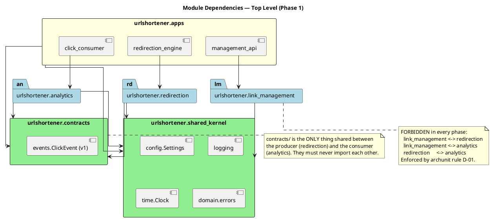
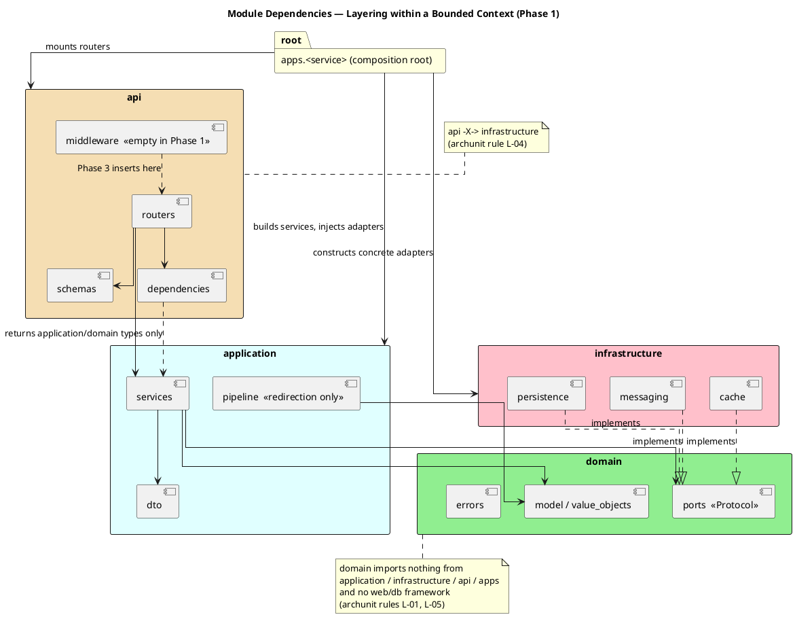
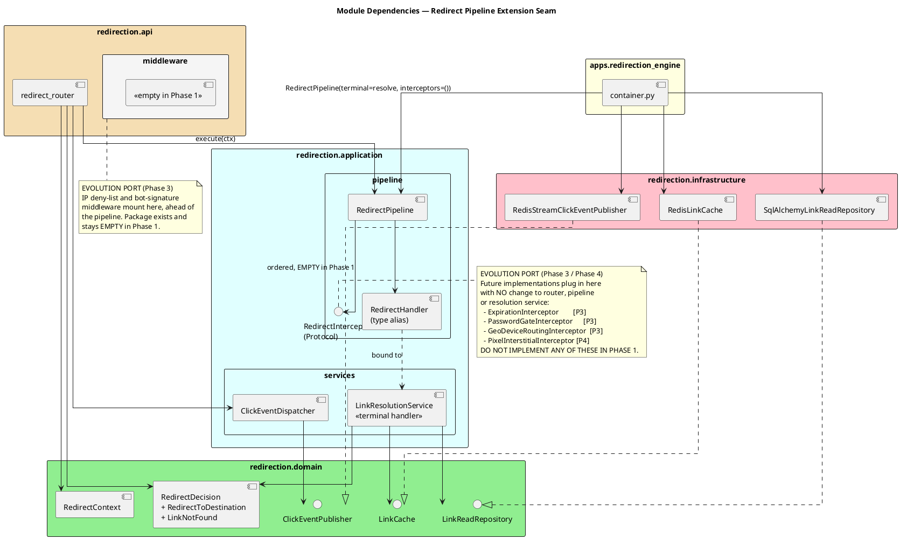
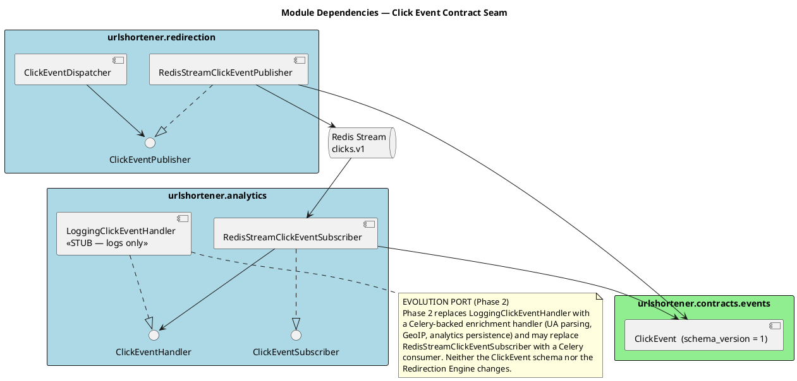
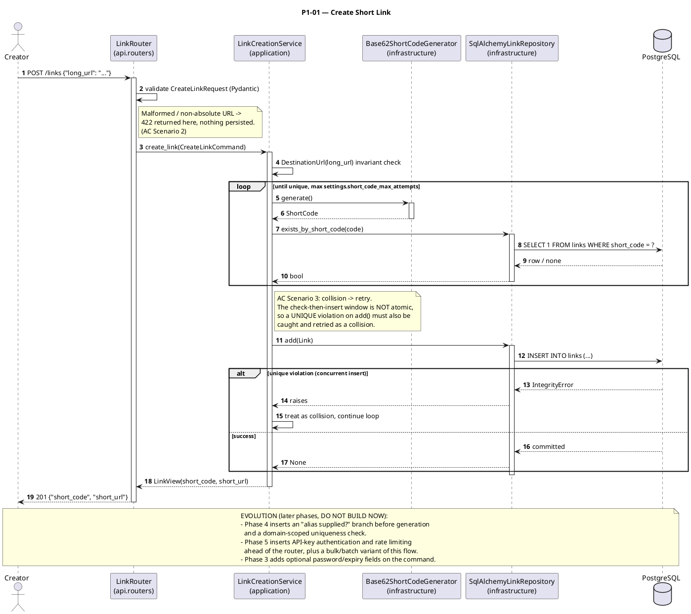
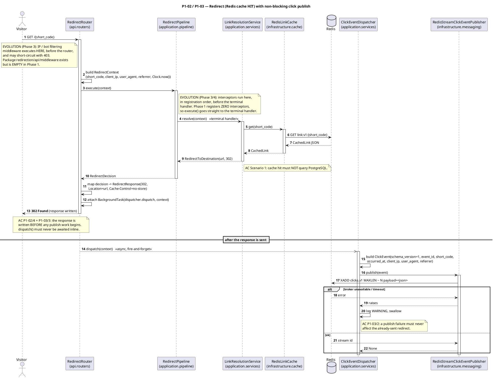
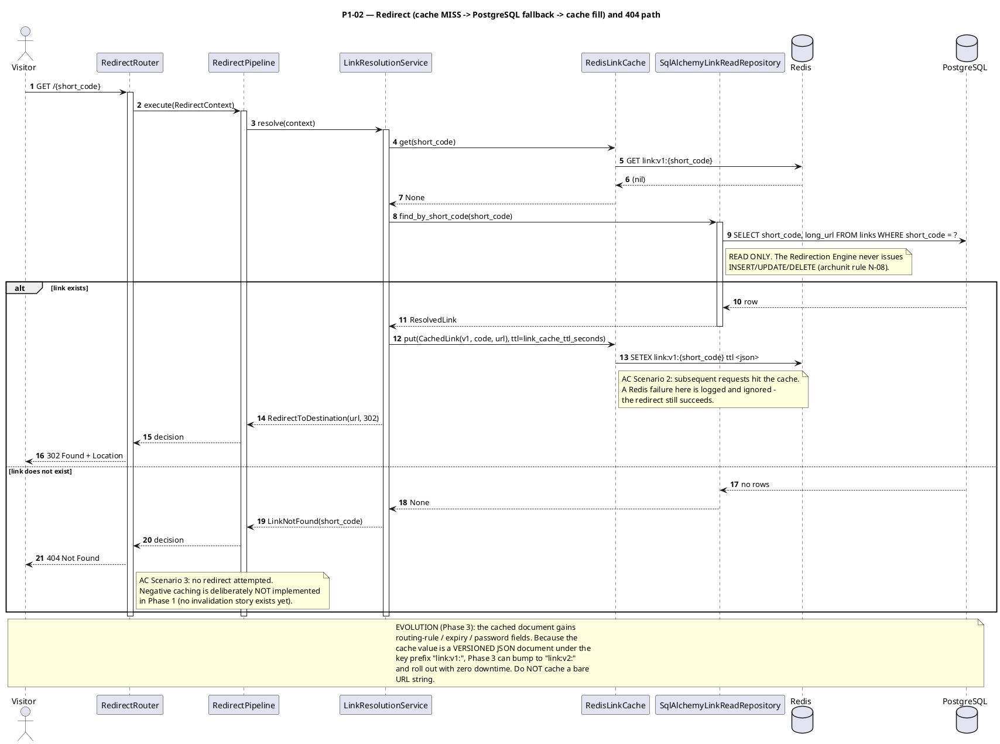
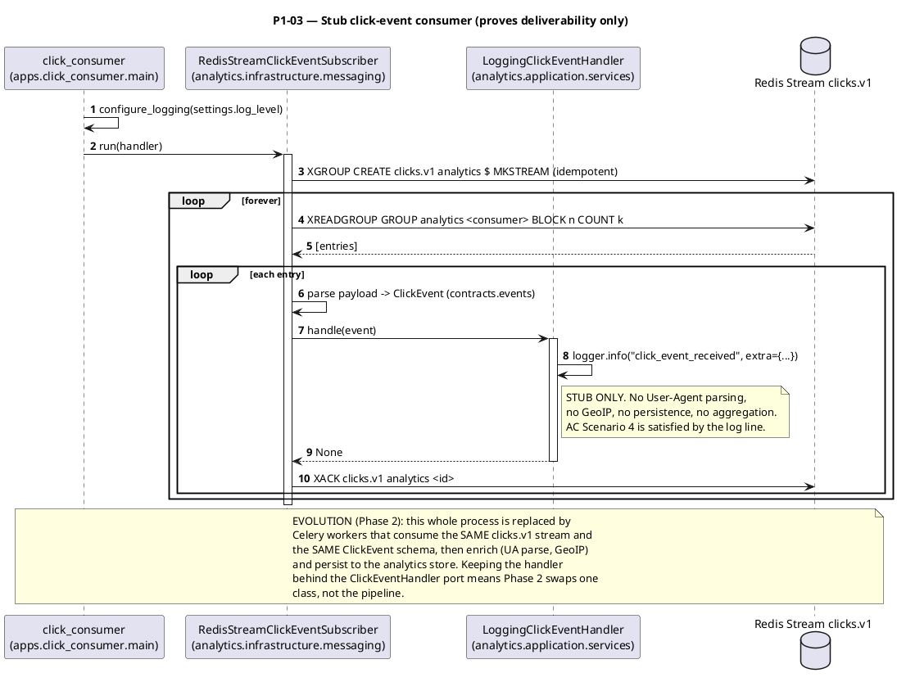
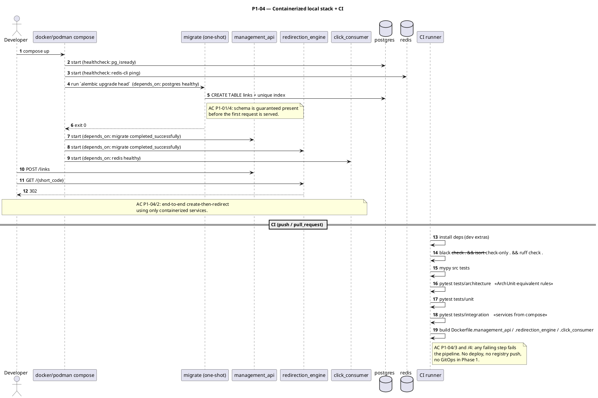

# System Diagrams — Phase 1: MVP (Core Redirection Loop)

**Phase ID:** `phase_1_mvp`
**Companion artifacts:** `./c4_architecture.md`, `./archunit_specs.md`

<!-- PHASE: Phase 1 MVP START -->

## 1. Module Dependency Diagrams

### 1.1 Top-level package dependencies

Dependencies are strictly unidirectional. `shared_kernel` and `contracts` are sinks (they import
nothing from the platform); `apps` is the only source that may reach every layer.

### 1.2 Layering inside a bounded context

Identical in `link_management`, `redirection`, and `analytics`. Note that `api` does **not** depend on
`infrastructure`: concrete adapters are constructed only in the composition root and handed to the API
layer as their abstract (application/domain) types.

### 1.3 Redirection Engine internals — the Phase 3 extension seam

The single most important structural decision of Phase 1: the router talks to a **pipeline**, and the
pipeline holds an ordered — currently empty — list of interceptors. Phase 3 adds classes; it changes
no existing file except the composition root's interceptor list.

### 1.4 Click-event producer/consumer seam

---

## 2. Sequence Diagrams

### 2.1 P1-01 — Create a short link (synchronous)

### 2.2 P1-02 + P1-03 — Redirect with cache hit (the hot path)

### 2.3 P1-02 — Redirect with cache miss (PostgreSQL fallback + cache fill)

### 2.4 P1-03 — Stub consumer proves the publish→consume path

### 2.5 P1-04 — Local stack startup and CI pipeline

<!-- PHASE: Phase 1 MVP END -->

---
*Generated by Architect Agent — scope: phase_1_mvp*
